# ERD toàn hệ thống siêu thị online

Ngày chốt thiết kế: 2026-08-07
Phạm vi: đồ án 30 ngày, 3 thành viên, 22 bảng

## 1. Phạm vi mô hình

ERD này bao phủ toàn bộ chức năng đã duyệt: tài khoản, địa chỉ, đa chi nhánh, catalog, so sánh sản phẩm, giá và tồn kho theo chi nhánh, giỏ hàng, coupon/khuyến mãi toàn đơn, đặt hàng, COD/VNPay/MoMo sandbox, đánh giá, recommendation, dự báo nhu cầu và cảnh báo tồn kho.

So sánh sản phẩm là chức năng phía client, lưu tối đa 3–4 sản phẩm cùng danh mục trong `localStorage`, nên không cần bảng database. Coupon được biểu diễn bằng `promotions.code`, không tách bảng `coupons`. Các phần chủ động loại khỏi mô hình: nhiều ảnh cho một sản phẩm, bảng đặt lại mật khẩu, khuyến mãi theo sản phẩm/danh mục, Buy 1 Get 1, nhà cung cấp, phiếu nhập, chuyển kho, đổi trả và giao vận thực tế.

## 2. ERD

```mermaid
erDiagram
    USERS ||--o{ ADDRESSES : owns
    USERS ||--o{ REFRESH_TOKENS : authenticates_with
    REFRESH_TOKENS o|--o| REFRESH_TOKENS : replaced_by

    CATEGORIES o|--o{ CATEGORIES : parent_of
    CATEGORIES ||--o{ PRODUCTS : classifies
    BRANDS ||--o{ PRODUCTS : brands
    BRANCHES ||--o{ BRANCH_INVENTORIES : stocks
    PRODUCTS ||--o{ BRANCH_INVENTORIES : stocked_at
    BRANCH_INVENTORIES ||--o{ INVENTORY_TRANSACTIONS : records
    USERS o|--o{ INVENTORY_TRANSACTIONS : performed_by

    USERS ||--o{ CARTS : owns
    BRANCHES ||--o{ CARTS : selected_for
    CARTS ||--o{ CART_ITEMS : contains
    PRODUCTS ||--o{ CART_ITEMS : added_as

    USERS ||--o{ ORDERS : places
    BRANCHES ||--o{ ORDERS : fulfills
    PROMOTIONS o|--o{ ORDERS : applied_to
    ORDERS ||--|{ ORDER_ITEMS : contains
    PRODUCTS ||--o{ ORDER_ITEMS : snapshotted_as
    ORDERS ||--|{ ORDER_STATUS_HISTORIES : changes_through
    USERS o|--o{ ORDER_STATUS_HISTORIES : changed_by
    ORDERS ||--o{ PAYMENTS : paid_by
    PAYMENTS o|--o{ PAYMENT_CALLBACKS : receives

    USERS ||--o{ REVIEWS : writes
    PRODUCTS ||--o{ REVIEWS : receives
    ORDER_ITEMS ||--o| REVIEWS : verifies_purchase

    USERS o|--o{ PRODUCT_VIEW_EVENTS : generates
    PRODUCTS ||--o{ PRODUCT_VIEW_EVENTS : viewed
    BRANCHES ||--o{ PRODUCT_VIEW_EVENTS : viewed_at
    USERS ||--o{ RECOMMENDATION_RESULTS : receives
    PRODUCTS ||--o{ RECOMMENDATION_RESULTS : recommended
    BRANCHES ||--o{ RECOMMENDATION_RESULTS : available_at
    BRANCHES ||--o{ DEMAND_FORECASTS : forecasts_for
    PRODUCTS ||--o{ DEMAND_FORECASTS : forecasts
    BRANCHES ||--o{ STOCK_ALERTS : alerts_at
    PRODUCTS ||--o{ STOCK_ALERTS : alerts_for
    DEMAND_FORECASTS o|--o{ STOCK_ALERTS : triggers

    USERS {
        char36 id PK
        varchar255 email UK
        varchar500 password_hash
        varchar150 full_name
        varchar20 phone
        varchar20 role
        varchar20 status
        datetime created_at_utc
        datetime updated_at_utc
    }

    ADDRESSES {
        char36 id PK
        char36 user_id FK
        varchar150 recipient_name
        varchar20 recipient_phone
        varchar100 province
        varchar100 district
        varchar100 ward
        varchar300 street
        boolean is_default
        datetime created_at_utc
        datetime updated_at_utc
    }

    REFRESH_TOKENS {
        char36 id PK
        char36 user_id FK
        varchar128 token_hash UK
        datetime expires_at_utc
        datetime revoked_at_utc
        char36 replaced_by_token_id FK
        datetime created_at_utc
    }

    BRANCHES {
        char36 id PK
        varchar150 name
        varchar300 address
        varchar20 phone
        decimal latitude
        decimal longitude
        boolean is_active
        datetime created_at_utc
        datetime updated_at_utc
    }

    CATEGORIES {
        char36 id PK
        char36 parent_category_id FK
        varchar120 name
        varchar140 slug UK
        boolean is_active
        datetime created_at_utc
        datetime updated_at_utc
    }

    BRANDS {
        char36 id PK
        varchar120 name
        varchar140 slug UK
        boolean is_active
        datetime created_at_utc
        datetime updated_at_utc
    }

    PRODUCTS {
        char36 id PK
        char36 category_id FK
        char36 brand_id FK
        varchar64 sku UK
        varchar200 name
        varchar220 slug UK
        text description
        decimal base_price
        varchar30 unit
        varchar500 image_url
        boolean is_active
        datetime created_at_utc
        datetime updated_at_utc
    }

    BRANCH_INVENTORIES {
        char36 id PK
        char36 branch_id FK
        char36 product_id FK
        decimal selling_price
        int quantity_on_hand
        int reserved_quantity
        int reorder_level
        datetime updated_at_utc
    }

    INVENTORY_TRANSACTIONS {
        char36 id PK
        char36 branch_inventory_id FK
        char36 performed_by_user_id FK
        varchar30 transaction_type
        int quantity_change
        int quantity_after
        varchar30 reference_type
        char36 reference_id
        varchar500 note
        datetime created_at_utc
    }

    CARTS {
        char36 id PK
        char36 user_id FK
        char36 branch_id FK
        datetime created_at_utc
        datetime updated_at_utc
    }

    CART_ITEMS {
        char36 id PK
        char36 cart_id FK
        char36 product_id FK
        int quantity
        datetime created_at_utc
        datetime updated_at_utc
    }

    PROMOTIONS {
        char36 id PK
        varchar150 name
        varchar50 code UK
        text description
        varchar20 discount_type
        decimal discount_value
        decimal min_order_amount
        decimal max_discount_amount
        int usage_limit
        int per_user_limit
        datetime start_at_utc
        datetime end_at_utc
        boolean is_active
        datetime created_at_utc
        datetime updated_at_utc
    }

    ORDERS {
        char36 id PK
        varchar30 order_number UK
        char36 user_id FK
        char36 branch_id FK
        char36 promotion_id FK
        varchar20 fulfillment_type
        varchar150 recipient_name
        varchar20 recipient_phone
        varchar500 delivery_address_snapshot
        varchar50 promotion_code_snapshot
        decimal subtotal
        decimal discount_amount
        decimal shipping_fee
        decimal total_amount
        varchar30 order_status
        varchar30 payment_status
        datetime created_at_utc
        datetime updated_at_utc
    }

    ORDER_ITEMS {
        char36 id PK
        char36 order_id FK
        char36 product_id FK
        varchar64 product_sku_snapshot
        varchar200 product_name_snapshot
        varchar30 unit_snapshot
        decimal unit_price
        int quantity
        decimal discount_amount
        decimal line_total
    }

    ORDER_STATUS_HISTORIES {
        char36 id PK
        char36 order_id FK
        char36 changed_by_user_id FK
        varchar30 from_status
        varchar30 to_status
        varchar500 note
        datetime created_at_utc
    }

    PAYMENTS {
        char36 id PK
        char36 order_id FK
        varchar20 method
        varchar20 provider
        varchar100 provider_transaction_id UK
        varchar100 request_id UK
        decimal amount
        varchar30 status
        datetime paid_at_utc
        datetime created_at_utc
        datetime updated_at_utc
    }

    PAYMENT_CALLBACKS {
        char36 id PK
        char36 payment_id FK
        varchar20 provider
        varchar150 external_event_id
        varchar128 payload_hash
        varchar50 response_code
        boolean is_signature_valid
        datetime processed_at_utc
        datetime created_at_utc
    }

    REVIEWS {
        char36 id PK
        char36 user_id FK
        char36 product_id FK
        char36 order_item_id FK,UK
        tinyint rating
        text comment
        varchar20 status
        datetime created_at_utc
        datetime updated_at_utc
    }

    PRODUCT_VIEW_EVENTS {
        char36 id PK
        char36 user_id FK
        char36 product_id FK
        char36 branch_id FK
        varchar100 anonymous_session_id
        datetime viewed_at_utc
    }

    RECOMMENDATION_RESULTS {
        char36 id PK
        char36 user_id FK
        char36 product_id FK
        char36 branch_id FK
        decimal score
        varchar250 reason
        datetime generated_at_utc
        datetime expires_at_utc
    }

    DEMAND_FORECASTS {
        char36 id PK
        char36 branch_id FK
        char36 product_id FK
        date forecast_date
        decimal predicted_quantity
        varchar30 method
        datetime generated_at_utc
    }

    STOCK_ALERTS {
        char36 id PK
        char36 branch_id FK
        char36 product_id FK
        char36 demand_forecast_id FK
        varchar20 alert_level
        int available_quantity
        decimal predicted_demand
        int recommended_quantity
        varchar20 status
        datetime created_at_utc
        datetime resolved_at_utc
    }
```

## 3. Chú thích ký hiệu

- `PK`: khóa chính.
- `FK`: khóa ngoại.
- `UK`: unique key.
- `FK_UK`: vừa là khóa ngoại vừa duy nhất.
- `||`: bắt buộc đúng một.
- `o|`: không hoặc một.
- `o{`: không hoặc nhiều.
- `|{`: một hoặc nhiều.
- Các cột có thể null: `revoked_at_utc`, `replaced_by_token_id`, `parent_category_id`, `performed_by_user_id`, `reference_type`, `reference_id`, `note`, `code`, `max_discount_amount`, `usage_limit`, `per_user_limit`, `promotion_id`, thông tin giao hàng khi nhận tại chi nhánh, `changed_by_user_id`, `from_status`, các mã giao dịch của COD, `payment_id` nếu callback chưa đối chiếu được, `user_id`/`anonymous_session_id` của sự kiện xem, `demand_forecast_id` và `resolved_at_utc`.

## 4. Chú thích theo nhóm bảng

### 4.1. Tài khoản

- `users` lưu tài khoản Customer/Admin. `role` dùng enum thay vì tách bảng role; `status` hỗ trợ `Active`, `Locked`, `Disabled`.
- `addresses` lưu nhiều địa chỉ giao hàng. Mỗi user chỉ có tối đa một địa chỉ mặc định.
- `refresh_tokens` lưu hash, không lưu token thô. Token có thể bị thu hồi và nối tới token thay thế để phát hiện reuse.

### 4.2. Chi nhánh và catalog

- `products` chứa thông tin chung; `base_price` là giá tham khảo, không phải giá bán cuối cùng tại mọi chi nhánh.
- `branch_inventories` mới là nguồn giá bán và số lượng theo chi nhánh. `(branch_id, product_id)` phải duy nhất.
- `categories` hỗ trợ cây cha-con qua `parent_category_id`. Không cho một category làm cha của chính nó hoặc tạo chu kỳ.
- Mỗi sản phẩm chỉ lưu một `image_url`; không có bảng nhiều ảnh.

### 4.3. Tồn kho

- `quantity_on_hand`: tổng hàng vật lý tại chi nhánh.
- `reserved_quantity`: hàng đang giữ cho các đơn chưa hoàn tất.
- `available_quantity = quantity_on_hand - reserved_quantity`; đây là giá trị tính toán, không lưu cột riêng.
- `inventory_transactions` là sổ lịch sử bất biến. `quantity_change` có dấu; `quantity_after` giúp đối soát nhanh.
- Các loại giao dịch tối thiểu: `StockIn`, `Reserve`, `Release`, `Sale`, `Adjustment`.

### 4.4. Giỏ hàng

- Một cart thuộc đúng một user và một branch; `(user_id, branch_id)` là duy nhất.
- `(cart_id, product_id)` là duy nhất trong `cart_items`.
- Cart không lưu giá. Khi hiển thị và checkout, backend đọc lại `branch_inventories` để tránh dùng giá hoặc tồn kho cũ.

### 4.5. So sánh sản phẩm (không có bảng)

- Guest và Customer có thể chọn tối đa 3–4 sản phẩm cùng danh mục để so sánh.
- Danh sách ID sản phẩm được lưu trong `localStorage`; backend chỉ cung cấp lại thông tin sản phẩm, giá và tồn kho theo chi nhánh hiện tại.
- Khi đổi chi nhánh, frontend phải tải lại giá và tồn kho. Không lưu comparison vào database trong phạm vi đồ án.

### 4.6. Khuyến mãi và coupon

- Chỉ có `promotions`; không có bảng `coupons` riêng và không có phạm vi theo sản phẩm hoặc danh mục.
- `code = NULL`: khuyến mãi tự động toàn đơn. `code` có giá trị: coupon khách phải nhập.
- `discount_type`: `Percentage` hoặc `FixedAmount`.
- Mỗi order dùng tối đa một promotion. Số lượt dùng toàn hệ thống và theo user được đếm từ các order hợp lệ, không cần bảng usage riêng.
- Không hỗ trợ Buy 1 Get 1 trong phạm vi 30 ngày.

### 4.7. Đơn hàng

- `orders` lưu snapshot người nhận/địa chỉ để lịch sử không thay đổi khi user sửa address.
- `order_items` lưu snapshot SKU, tên, đơn vị và giá. Xóa mềm/ngừng bán product không làm sai đơn cũ.
- Tổng tiền tuân theo `total_amount = subtotal - discount_amount + shipping_fee` và không được âm.
- `fulfillment_type`: `Delivery` hoặc `Pickup`. Pickup không yêu cầu địa chỉ giao hàng.
- `order_status_histories` ghi mọi lần chuyển trạng thái; bản ghi đầu có thể có `from_status = NULL`.
- Luồng chính: `Pending -> Confirmed -> Preparing -> ReadyForPickup/Shipping -> Completed`; hủy chỉ từ trạng thái được cho phép.

### 4.8. Thanh toán

- Một order có thể có nhiều payment vì người dùng có thể thử lại thanh toán; chỉ một payment được thành công.
- `method`: `COD`, `VNPay`, `MoMo`. `provider` có thể là `Internal`, `VNPay`, `MoMo`.
- `payment_callbacks` lưu dấu vết callback/IPN và kiểm tra chữ ký. `(provider, external_event_id)` phải duy nhất để chống xử lý lặp.
- Return URL chỉ hiển thị kết quả; callback/IPN hợp lệ mới được cập nhật payment và order.
- Không lưu số thẻ, CVV hoặc ngày hết hạn.

### 4.9. Đánh giá

- `order_item_id` duy nhất bảo đảm mỗi dòng hàng chỉ được review một lần.
- Chỉ user sở hữu order đã `Completed` mới được tạo review.
- `rating` nằm trong khoảng 1–5; `status`: `Pending`, `Published`, `Hidden`.

### 4.10. AI

- `product_view_events` ghi hành vi xem. Guest dùng `anonymous_session_id`; customer dùng `user_id`; ít nhất một trong hai phải có giá trị.
- `recommendation_results` lưu kết quả đã tính cho customer theo branch. Guest/cold-start dùng danh sách fallback và không cần lưu bảng.
- `demand_forecasts` lưu dự báo theo ngày cho từng cặp branch-product; `(branch_id, product_id, forecast_date)` là duy nhất cho lần chạy hiện hành.
- `stock_alerts` được tạo khi nhu cầu dự báo cộng safety stock vượt lượng có thể bán. Trạng thái: `Open`, `Acknowledged`, `Resolved`.

## 5. Ràng buộc và chỉ mục bắt buộc

| Bảng | Ràng buộc/chỉ mục |
|---|---|
| `users` | unique `email`; index `(status, role)` |
| `addresses` | index `user_id`; cơ chế ứng dụng bảo đảm một địa chỉ mặc định/user |
| `refresh_tokens` | unique `token_hash`; index `(user_id, expires_at_utc)` |
| `categories`, `brands`, `products` | unique `slug`; product unique `sku` |
| `branch_inventories` | unique `(branch_id, product_id)`; check giá/số lượng không âm và reserved không vượt on-hand |
| `inventory_transactions` | index `(branch_inventory_id, created_at_utc)` và `(reference_type, reference_id)` |
| `carts` | unique `(user_id, branch_id)` |
| `cart_items` | unique `(cart_id, product_id)`; check `quantity > 0` |
| `promotions` | unique nullable `code`; check thời gian và giá trị giảm hợp lệ |
| `orders` | unique `order_number`; index `(user_id, created_at_utc)` và `(branch_id, order_status)` |
| `order_items` | index `order_id`; check `quantity > 0` và tiền không âm |
| `order_status_histories` | index `(order_id, created_at_utc)` |
| `payments` | unique nullable `provider_transaction_id`; unique `request_id`; index `(order_id, status)` |
| `payment_callbacks` | unique `(provider, external_event_id)` |
| `reviews` | unique `order_item_id`; check `rating BETWEEN 1 AND 5`; index `(product_id, status)` |
| `product_view_events` | index `(user_id, viewed_at_utc)` và `(product_id, viewed_at_utc)` |
| `recommendation_results` | index `(user_id, branch_id, score)` và `expires_at_utc` |
| `demand_forecasts` | unique `(branch_id, product_id, forecast_date)` |
| `stock_alerts` | index `(branch_id, status, alert_level)` |

## 6. Quy tắc dữ liệu chung

- Khóa chính dùng UUID lưu dạng `char(36)` để khớp foundation hiện tại.
- Tiền dùng `decimal(18,2)`; điểm recommendation dùng độ chính xác riêng phù hợp khi mapping EF Core.
- Tất cả thời điểm lưu UTC bằng `datetime(6)`; frontend chuyển sang múi giờ hiển thị.
- Dữ liệu nghiệp vụ quan trọng ưu tiên ngừng hoạt động/ẩn thay vì xóa vật lý.
- Foreign key mặc định `Restrict`; category cha dùng `SetNull`. Các bảng con thuần sở hữu như cart item có thể `Cascade` khi xóa cart.
- Checkout phải khóa/kiểm tra tồn kho và cập nhật reserve trong cùng transaction MySQL để không bán âm kho.
- Báo cáo doanh thu truy vấn từ `orders` và `order_items`; không tạo bảng báo cáo riêng trong phạm vi đồ án.

## 7. Tổng số bảng

| Nhóm | Số lượng |
|---|---:|
| Tài khoản | 3 |
| Chi nhánh và catalog | 4 |
| Tồn kho | 2 |
| Giỏ hàng | 2 |
| Khuyến mãi | 1 |
| Đơn hàng | 3 |
| Thanh toán | 2 |
| Đánh giá | 1 |
| AI | 4 |
| **Tổng cộng** | **22** |
