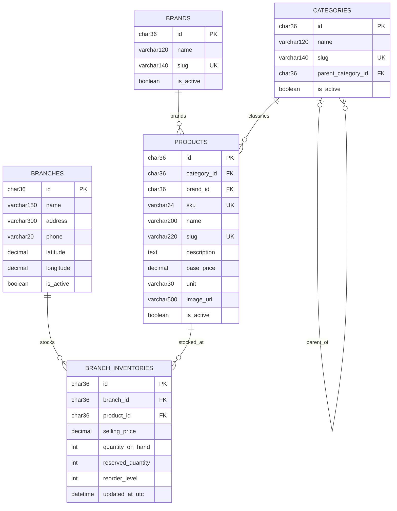

# Sprint 1 ERD

Sprint 1 tạo năm bảng nền tảng cho catalog và tồn kho đa chi nhánh. Giá bán và số lượng không nằm trực tiếp trên `products`; chúng thuộc quan hệ `branch_inventories` để mỗi chi nhánh có dữ liệu riêng.

## Ràng buộc chính

- `(branch_id, product_id)` là unique key trên `branch_inventories`.
- `sku`, product `slug`, category `slug` và brand `slug` là duy nhất.
- `available_quantity = quantity_on_hand - reserved_quantity` được tính trong domain, không lưu thành cột.
- Xóa category/brand/product/branch đang được tham chiếu bị hạn chế; category cha bị xóa sẽ đặt `parent_category_id` thành `NULL`.
- Tiền dùng `decimal(18,2)`; identifier dùng UUID lưu dưới dạng `char(36)`.
