# Thiết Kế Cơ Sở Dữ Liệu & ERD Hệ Thống Siêu Thị Trực Tuyến

Ngày cập nhật: 2026-08-23  
Trạng thái: **OFFICIAL (Canonical)**  
Phạm vi: 16 bảng đã triển khai EF Core Migrations + 7 bảng mở rộng kế hoạch (Tổng 23 bảng)

---

## 1. Phạm Vi Mô Hình

ERD này bao phủ toàn bộ kiến trúc dữ liệu của hệ thống Siêu thị điện tử trực tuyến:
- **Tài khoản & Định danh (Identity)**: Người dùng, Refresh Token xoay vòng, Token đặt lại mật khẩu.
- **Sổ địa chỉ & Khách hàng (Customer & Shopping)**: Địa chỉ giao hàng nhận dạng theo User, cờ địa chỉ mặc định transactional.
- **Danh mục & Đa chi nhánh (Catalog & Multi-Branch)**: Danh mục sản phẩm đa cấp, thương hiệu, sản phẩm và chi nhánh vật lý.
- **Tồn kho chi nhánh (Inventory)**: Quản lý giá bán (`selling_price`), tồn kho thực tế (`quantity_on_hand`), tồn kho đã khóa giữ (`reserved_quantity`), tồn kho khả dụng (`available_quantity`), và định mức nhập hàng (`reorder_level`) riêng biệt theo từng chi nhánh.
- **Giỏ hàng (Shopping Cart)**: Giỏ hàng gắn liền với User và Chi nhánh đang chọn, kiểm tra tồn kho tức thời.
- **Đơn hàng & Giao dịch (Orders & Transactions)**: Đơn hàng đa hình thức (Pickup / Delivery), snapshot địa chỉ, snapshot tên & giá sản phẩm, lịch sử chuyển trạng thái đơn hàng.
- **Thanh toán Sandbox (Payments)**: Phương thức thanh toán (COD, VNPay, MoMo), giao dịch thanh toán và webhook/callback idempotency.
- **Phân hệ mở rộng (Planned)**: Khuyến mãi/Coupon (`PROMOTIONS`), Đánh giá (`REVIEWS`), Nhật ký biến động kho (`INVENTORY_TRANSACTIONS`), Dữ liệu sự kiện & AI (`PRODUCT_VIEW_EVENTS`, `RECOMMENDATION_RESULTS`, `DEMAND_FORECASTS`, `STOCK_ALERTS`).

---

## 2. Sơ Đồ ERD Tổng Thể

```mermaid
erDiagram
    USERS ||--o{ ADDRESSES : owns
    USERS ||--o{ REFRESH_TOKENS : authenticates_with
    USERS ||--o{ PASSWORD_RESET_TOKENS : requests_reset
    REFRESH_TOKENS o|--o| REFRESH_TOKENS : replaced_by

    CATEGORIES o|--o{ CATEGORIES : parent_of
    CATEGORIES ||--o{ PRODUCTS : classifies
    BRANDS ||--o{ PRODUCTS : brands
    BRANCHES ||--o{ BRANCH_INVENTORIES : stocks
    PRODUCTS ||--o{ BRANCH_INVENTORIES : stocked_at
    BRANCH_INVENTORIES ||--o{ INVENTORY_TRANSACTIONS : records
    USERS o|--o{ INVENTORY_TRANSACTIONS : performed_by

    USERS ||--o{ CARTS : owns
    BRANCHES ||--o{ CARTS : selected_for
    CARTS ||--o{ CART_ITEMS : contains
    PRODUCTS ||--o{ CART_ITEMS : added_as

    USERS ||--o{ ORDERS : places
    BRANCHES ||--o{ ORDERS : fulfills
    PROMOTIONS o|--o{ ORDERS : applied_to
    ORDERS ||--|{ ORDER_ITEMS : contains
    PRODUCTS ||--o{ ORDER_ITEMS : snapshotted_as
    ORDERS ||--|{ ORDER_STATUS_HISTORIES : changes_through
    USERS o|--o{ ORDER_STATUS_HISTORIES : changed_by
    ORDERS ||--o{ PAYMENTS : paid_by
    PAYMENTS o|--o{ PAYMENT_CALLBACKS : receives

    USERS ||--o{ REVIEWS : writes
    PRODUCTS ||--o{ REVIEWS : receives
    ORDER_ITEMS ||--o| REVIEWS : verifies_purchase

    USERS o|--o{ PRODUCT_VIEW_EVENTS : generates
    PRODUCTS ||--o{ PRODUCT_VIEW_EVENTS : viewed
    BRANCHES ||--o{ PRODUCT_VIEW_EVENTS : viewed_at
    USERS ||--o{ RECOMMENDATION_RESULTS : receives
    PRODUCTS ||--o{ RECOMMENDATION_RESULTS : recommended
    BRANCHES ||--o{ RECOMMENDATION_RESULTS : available_at
    BRANCHES ||--o{ DEMAND_FORECASTS : forecasts_for
    PRODUCTS ||--o{ DEMAND_FORECASTS : forecasts
    BRANCHES ||--o{ STOCK_ALERTS : alerts_at
    PRODUCTS ||--o{ STOCK_ALERTS : alerts_for
    DEMAND_FORECASTS o|--o{ STOCK_ALERTS : triggers

    USERS {
        char36 id PK
        varchar255 email UK
        varchar500 password_hash
        varchar150 full_name
        varchar20 phone
        varchar20 role
        varchar20 status
        datetime created_at_utc
        datetime updated_at_utc
    }

    ADDRESSES {
        char36 id PK
        char36 user_id FK
        varchar150 recipient_name
        varchar20 phone
        varchar500 street
        varchar100 ward
        varchar100 district
        varchar100 city
        varchar20 postal_code
        boolean is_default
        datetime created_at_utc
        datetime updated_at_utc
    }

    REFRESH_TOKENS {
        char36 id PK
        char36 user_id FK
        varchar128 token_hash UK
        datetime expires_at_utc
        datetime revoked_at_utc
        char36 replaced_by_token_id FK
        datetime created_at_utc
    }

    PASSWORD_RESET_TOKENS {
        char36 id PK
        char36 user_id FK
        varchar128 token_hash UK
        datetime expires_at_utc
        datetime created_at_utc
        boolean is_used
    }

    BRANCHES {
        char36 id PK
        varchar150 name
        varchar300 address
        varchar20 phone
        decimal latitude
        decimal longitude
        boolean is_active
        datetime created_at_utc
        datetime updated_at_utc
    }

    CATEGORIES {
        char36 id PK
        char36 parent_category_id FK
        varchar120 name
        varchar140 slug UK
        boolean is_active
        datetime created_at_utc
        datetime updated_at_utc
    }

    BRANDS {
        char36 id PK
        varchar120 name
        varchar140 slug UK
        boolean is_active
        datetime created_at_utc
        datetime updated_at_utc
    }

    PRODUCTS {
        char36 id PK
        char36 category_id FK
        char36 brand_id FK
        varchar64 sku UK
        varchar200 name
        varchar220 slug UK
        text description
        decimal base_price
        varchar30 unit
        varchar500 image_url
        boolean is_active
        datetime created_at_utc
        datetime updated_at_utc
    }

    BRANCH_INVENTORIES {
        char36 id PK
        char36 branch_id FK
        char36 product_id FK
        decimal selling_price
        int quantity_on_hand
        int reserved_quantity
        int reorder_level
        datetime updated_at_utc
    }

    CARTS {
        char36 id PK
        char36 user_id FK
        char36 branch_id FK
        datetime created_at_utc
        datetime updated_at_utc
    }

    CART_ITEMS {
        char36 id PK
        char36 cart_id FK
        char36 product_id FK
        char36 branch_inventory_id FK
        decimal unit_price
        int quantity
        datetime created_at_utc
        datetime updated_at_utc
    }

    ORDERS {
        char36 id PK
        char36 user_id FK
        char36 branch_id FK
        varchar30 fulfillment_type
        varchar150 recipient_name
        varchar20 recipient_phone
        text delivery_address_snapshot
        char36 delivery_address_id FK
        decimal subtotal
        decimal discount_amount
        decimal shipping_fee
        decimal total_amount
        varchar50 promotion_code_snapshot
        varchar30 status
        datetime created_at_utc
        datetime updated_at_utc
    }

    ORDER_ITEMS {
        char36 id PK
        char36 order_id FK
        char36 product_id FK
        varchar200 product_name_snapshot
        varchar64 sku_snapshot
        decimal unit_price
        int quantity
        decimal line_total
    }

    ORDER_STATUS_HISTORIES {
        char36 id PK
        char36 order_id FK
        varchar30 from_status
        varchar30 to_status
        varchar500 note
        datetime created_at_utc
    }

    PAYMENTS {
        char36 id PK
        char36 order_id FK
        varchar30 method
        decimal amount
        varchar30 status
        varchar100 provider_transaction_id
        text raw_response
        datetime created_at_utc
        datetime updated_at_utc
    }

    PAYMENT_CALLBACKS {
        char36 id PK
        char36 payment_id FK
        varchar50 provider
        varchar128 external_event_id
        text payload_json
        boolean is_signature_valid
        decimal callback_amount
        varchar30 result_status
        datetime received_at_utc
    }
```

---

## 3. Trạng Thái Hiện Thực Cơ Sở Dữ Liệu

### 3.1. Các Bảng Đã Triển Khai Qua EF Core Migrations (16 Bảng)

1. **`users`**: Tài khoản người dùng (Email, PasswordHash, FullName, Phone, Role: `Customer`/`Admin`, Status: `Active`/`Locked`/`Disabled`).
2. **`refresh_tokens`**: Token làm mới JWT xoay vòng, lưu SHA-256 hash và cơ chế phát hiện reuse qua `replaced_by_token_id`.
3. **`password_reset_tokens`**: Token đặt lại mật khẩu an toàn theo thời hạn và chỉ dùng 1 lần (`is_used`).
4. **`addresses`**: Sổ địa chỉ giao hàng của người dùng, cờ `is_default` được cập nhật transactional.
5. **`branches`**: Chi nhánh siêu thị vật lý (tên, địa chỉ, số điện thoại, tọa độ lat/long, trạng thái hoạt động).
6. **`categories`**: Cây danh mục sản phẩm hỗ trợ quan hệ cha - con (`parent_category_id`).
7. **`brands`**: Thương hiệu sản phẩm.
8. **`products`**: Thông tin sản phẩm dùng chung (SKU, tên, slug, giá cơ bản `base_price`, đơn vị tính `unit`, ảnh đại diện).
9. **`branch_inventories`**: Giá bán và tồn kho theo từng chi nhánh (`selling_price`, `quantity_on_hand`, `reserved_quantity`, `reorder_level`).
10. **`carts`**: Giỏ hàng liên kết giữa User và Chi nhánh mua sắm hiện tại.
11. **`cart_items`**: Chi tiết sản phẩm trong giỏ hàng (số lượng, đơn giá, liên kết kho chi nhánh).
12. **`orders`**: Đơn hàng (mã đơn, chi nhánh fulfillment, phương thức nhận hàng, snapshot thông tin giao hàng, tổng tiền, trạng thái).
13. **`order_items`**: Chi tiết mặt hàng đã đặt, snapshot tên sản phẩm và SKU tại thời điểm đặt hàng.
14. **`order_status_histories`**: Lịch sử chuyển đổi trạng thái đơn hàng (`Pending` -> `Confirmed` -> `Preparing` -> `Shipping` -> `Completed` / `Cancelled`).
15. **`payments`**: Giao dịch thanh toán gắn với đơn hàng (COD, VNPay, MoMo, số tiền, mã giao dịch cổng, trạng thái).
16. **`payment_callbacks`**: Bản ghi webhook / IPN callback từ các cổng thanh toán (chống trùng lặp idempotency, kiểm tra chữ ký).

---

### 3.2. Các Bảng Quy Hoạch Cho Giai Đoạn Mở Rộng (7 Bảng)

17. **`promotions`**: Quản lý chương trình khuyến mãi và mã giảm giá (`code`, `discount_type`, `discount_value`, `min_order_amount`, `usage_limit`).
18. **`reviews`**: Đánh giá và bình luận sản phẩm dựa trên đơn hàng đã hoàn thành (Verified Purchase).
19. **`inventory_transactions`**: Nhật ký lịch sử nhập kho, xuất kho, điều chỉnh kiểm kê theo từng chi nhánh.
20. **`product_view_events`**: Ghi nhận hành vi xem sản phẩm của khách hàng phục vụ gợi ý.
21. **`recommendation_results`**: Kết quả tính toán gợi ý sản phẩm cho từng user tại chi nhánh.
22. **`demand_forecasts`**: Kết quả dự báo nhu cầu tiêu thụ sản phẩm 7-14 ngày tới.
23. **`stock_alerts`**: Cảnh báo nguy cơ thiếu hụt tồn kho dựa trên dự báo và lượng hàng thực tế.

---

## 4. Chuẩn Hóa Dữ Liệu & Ràng Buộc (3NF Compliance)

Mô hình dữ liệu tuân thủ nghiêm ngặt **Chuẩn 3 (Third Normal Form - 3NF)**:
1. **1NF**: Tất cả các trường dữ liệu đều mang tính nguyên tố, mỗi bảng đều có Khóa chính (`CHAR(36)` GUID).
2. **2NF**: Toàn bộ các thuộc tính không khóa đều phụ thuộc đầy đủ vào Khóa chính.
3. **3NF**: Không có thuộc tính nào phụ thuộc bắc cầu.
   - *Snapshot fields hợp lệ*: Các trường snapshot như `product_name_snapshot`, `sku_snapshot`, `delivery_address_snapshot` trong đơn hàng là **dữ liệu lịch sử bất biến** tại thời điểm giao dịch, không vi phạm 3NF vì chúng phản ánh đúng bản chất hợp đồng pháp lý của đơn hàng tại thời điểm đặt.
