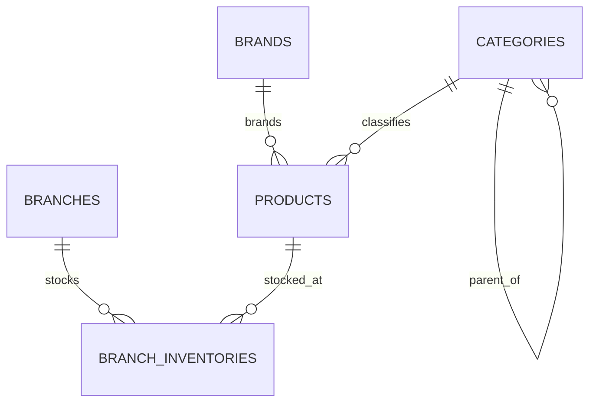

# Sprint 1 Foundation Implementation Plan

> **For agentic workers:** REQUIRED SUB-SKILL: Use superpowers:subagent-driven-development (recommended) or superpowers:executing-plans to implement this plan task-by-task. Steps use checkbox (`- [ ]`) syntax for tracking.

**Goal:** Tạo nền tảng chạy được và kiểm thử được cho Online Supermarket System gồm ASP.NET Core API, React storefront shell, MySQL, Docker Compose, mô hình dữ liệu lõi, ERD và OpenAPI.

**Architecture:** Một repository chứa `backend`, `frontend`, `docs` và cấu hình triển khai. Backend là modular monolith theo feature, dùng EF Core với MySQL; frontend là React + TypeScript gọi API qua một client duy nhất. Sprint này chỉ dựng foundation và các entity nền tảng, chưa triển khai auth, catalog CRUD, checkout, payment hoặc AI.

**Tech Stack:** .NET SDK 10.0.103, ASP.NET Core 10, EF Core 10.0.9, MySql.EntityFrameworkCore 10.0.9, xUnit, React 19, TypeScript, Vite 7, Vitest, Testing Library, Node.js 24 LTS, MySQL 8.4 LTS, Docker Compose.

## Global Constraints

- Dự án là đồ án 30 ngày của nhóm 3 người; ưu tiên cấu trúc dễ hiểu và demo ổn định.
- Backend là monolith phân lớp/modular, không dùng microservices, Redis, queue hoặc Kubernetes.
- Giá và tồn kho phải thuộc chi nhánh; không đặt tồn kho trực tiếp trên `Product`.
- Không lưu số thẻ, ngày hết hạn hoặc CVV; secret chỉ đến từ environment variables.
- Repository chỉ chứa `.env.example`, không commit `.env`.
- AI, payment và nghiệp vụ checkout nằm ngoài Sprint 1.
- Mọi hành vi mới phải đi theo chu kỳ test đỏ → code tối thiểu → test xanh → commit.
- Docker chưa có trong PATH của máy hiện tại; bước kiểm tra Compose được thực hiện ngay khi Docker Desktop được cài.

---

## File Map

```text
OnlineSupermarket.slnx                         solution manifest
global.json                                   khóa .NET SDK 10.0.103
Directory.Build.props                         nullable, warnings, analyzers chung
.editorconfig                                 convention C#/TS cơ bản
.gitignore                                    loại build output, node_modules, .env
.env.example                                  biến môi trường demo không chứa secret thật
compose.yaml                                  frontend + api + mysql
backend/src/OnlineSupermarket.Api/             composition root và HTTP endpoints
backend/src/OnlineSupermarket.Domain/          entity và business invariants lõi
backend/src/OnlineSupermarket.Infrastructure/  EF Core, MySQL và migrations
backend/tests/OnlineSupermarket.Domain.Tests/  unit tests entity/invariants
backend/tests/OnlineSupermarket.Api.Tests/     integration tests HTTP
frontend/                                     React/Vite storefront shell
docs/architecture/erd.md                       Mermaid ERD Sprint 1
docs/api/openapi.json                          contract tạo từ API
scripts/export-openapi.ps1                     xuất OpenAPI có thể lặp lại
```

### Task 1: Khóa toolchain và tạo solution skeleton

**Files:**
- Create: `global.json`
- Create: `Directory.Build.props`
- Create: `.editorconfig`
- Create: `.gitignore`
- Create: `OnlineSupermarket.slnx`
- Create: `backend/src/OnlineSupermarket.Api/OnlineSupermarket.Api.csproj`
- Create: `backend/src/OnlineSupermarket.Domain/OnlineSupermarket.Domain.csproj`
- Create: `backend/src/OnlineSupermarket.Infrastructure/OnlineSupermarket.Infrastructure.csproj`
- Create: `backend/tests/OnlineSupermarket.Domain.Tests/OnlineSupermarket.Domain.Tests.csproj`
- Create: `backend/tests/OnlineSupermarket.Api.Tests/OnlineSupermarket.Api.Tests.csproj`

**Interfaces:**
- Produces: solution `OnlineSupermarket.slnx`; projects `OnlineSupermarket.Api`, `OnlineSupermarket.Domain`, `OnlineSupermarket.Infrastructure`, `OnlineSupermarket.Domain.Tests`, `OnlineSupermarket.Api.Tests`.
- Produces: `Api -> Infrastructure -> Domain`; tests reference only the projects they exercise.

- [ ] **Step 1: Write the solution membership check**

Create the solution and project files through `dotnet new`, then make the check itself the first failing verification:

```powershell
dotnet sln OnlineSupermarket.slnx list
```

Expected before adding projects: output does not list all five required projects.

- [ ] **Step 2: Add project references and package versions**

Use these exact settings in `Directory.Build.props`:

```xml
<Project>
  <PropertyGroup>
    <TargetFramework>net10.0</TargetFramework>
    <Nullable>enable</Nullable>
    <ImplicitUsings>enable</ImplicitUsings>
    <TreatWarningsAsErrors>true</TreatWarningsAsErrors>
  </PropertyGroup>
</Project>
```

Add `Api -> Infrastructure`, `Infrastructure -> Domain`, both test references, then add all projects to the solution. Pin `Microsoft.EntityFrameworkCore*` and `MySql.EntityFrameworkCore` to `10.0.9`, `Microsoft.AspNetCore.Mvc.Testing` to `10.0.9`, and xUnit packages to the versions emitted by the installed .NET 10 template.

- [ ] **Step 3: Add repository exclusions**

`.gitignore` must include:

```gitignore
**/bin/
**/obj/
**/node_modules/
**/dist/
.env
*.user
TestResults/
.codegraph/codegraph.db
```

- [ ] **Step 4: Verify the skeleton**

Run:

```powershell
dotnet restore OnlineSupermarket.slnx
dotnet build OnlineSupermarket.slnx --no-restore
dotnet sln OnlineSupermarket.slnx list
```

Expected: restore/build pass with zero warnings; all five projects are listed.

- [ ] **Step 5: Commit**

```powershell
git add global.json Directory.Build.props .editorconfig .gitignore OnlineSupermarket.slnx backend
git commit -m "build: scaffold backend solution"
```

### Task 2: Tạo API health endpoint bằng integration test

**Files:**
- Create: `backend/src/OnlineSupermarket.Api/Program.cs`
- Create: `backend/src/OnlineSupermarket.Api/Contracts/HealthResponse.cs`
- Create: `backend/tests/OnlineSupermarket.Api.Tests/HealthEndpointTests.cs`

**Interfaces:**
- Produces: `GET /api/health` returning HTTP 200 and JSON `{ "status": "ok" }`.
- Produces: public partial `Program` marker for `WebApplicationFactory<Program>`.

- [ ] **Step 1: Write the failing integration test**

```csharp
public sealed class HealthEndpointTests(
    WebApplicationFactory<Program> factory)
    : IClassFixture<WebApplicationFactory<Program>>
{
    [Fact]
    public async Task GetHealth_ReturnsOkPayload()
    {
        using var client = factory.CreateClient();
        var response = await client.GetAsync("/api/health");
        response.EnsureSuccessStatusCode();
        var payload = await response.Content.ReadFromJsonAsync<HealthResponse>();
        Assert.Equal("ok", payload?.Status);
    }
}
```

- [ ] **Step 2: Run the focused test and observe failure**

Run:

```powershell
dotnet test backend/tests/OnlineSupermarket.Api.Tests --filter GetHealth_ReturnsOkPayload
```

Expected: FAIL because `/api/health` or `HealthResponse` does not exist.

- [ ] **Step 3: Implement the minimal endpoint**

`HealthResponse.cs`:

```csharp
namespace OnlineSupermarket.Api.Contracts;

public sealed record HealthResponse(string Status);
```

Map the endpoint in `Program.cs`:

```csharp
app.MapGet("/api/health", () => Results.Ok(new HealthResponse("ok")))
   .WithName("GetHealth")
   .WithTags("System");

public partial class Program;
```

- [ ] **Step 4: Verify API tests**

Run:

```powershell
dotnet test backend/tests/OnlineSupermarket.Api.Tests
```

Expected: PASS.

- [ ] **Step 5: Commit**

```powershell
git add backend/src/OnlineSupermarket.Api backend/tests/OnlineSupermarket.Api.Tests
git commit -m "feat: add API health endpoint"
```

### Task 3: Tạo domain model nền tảng và invariants

**Files:**
- Create: `backend/src/OnlineSupermarket.Domain/Common/Entity.cs`
- Create: `backend/src/OnlineSupermarket.Domain/Branches/Branch.cs`
- Create: `backend/src/OnlineSupermarket.Domain/Catalog/Category.cs`
- Create: `backend/src/OnlineSupermarket.Domain/Catalog/Brand.cs`
- Create: `backend/src/OnlineSupermarket.Domain/Catalog/Product.cs`
- Create: `backend/src/OnlineSupermarket.Domain/Inventory/BranchInventory.cs`
- Create: `backend/tests/OnlineSupermarket.Domain.Tests/Inventory/BranchInventoryTests.cs`

**Interfaces:**
- Produces: `BranchInventory.Create(Guid branchId, Guid productId, decimal sellingPrice, int quantityOnHand, int reorderLevel)`.
- Produces: read-only properties `SellingPrice`, `QuantityOnHand`, `ReservedQuantity`, `AvailableQuantity`, `ReorderLevel`.
- Invariant: price, quantity, reserved quantity and reorder level never become negative; `ReservedQuantity <= QuantityOnHand`.

- [ ] **Step 1: Write failing invariant tests**

```csharp
[Fact]
public void Create_WithValidValues_ComputesAvailableQuantity()
{
    var inventory = BranchInventory.Create(Guid.NewGuid(), Guid.NewGuid(), 25_000m, 10, 2);
    Assert.Equal(10, inventory.AvailableQuantity);
}

[Theory]
[InlineData(-1, 10, 2)]
[InlineData(1000, -1, 2)]
[InlineData(1000, 10, -1)]
public void Create_WithNegativeValue_Throws(decimal price, int quantity, int reorderLevel)
{
    Assert.Throws<ArgumentOutOfRangeException>(() =>
        BranchInventory.Create(Guid.NewGuid(), Guid.NewGuid(), price, quantity, reorderLevel));
}
```

- [ ] **Step 2: Run tests and observe failure**

Run:

```powershell
dotnet test backend/tests/OnlineSupermarket.Domain.Tests --filter BranchInventoryTests
```

Expected: FAIL because `BranchInventory` does not exist.

- [ ] **Step 3: Implement the minimal model**

Use private constructors for EF Core and named factory methods for valid creation. `AvailableQuantity` must be computed exactly as:

```csharp
public int AvailableQuantity => QuantityOnHand - ReservedQuantity;
```

All text fields (`Name`, `Slug`, `Sku`) must reject null/whitespace. Keep domain classes free from EF Core attributes; persistence mapping belongs to Infrastructure.

- [ ] **Step 4: Verify domain tests**

Run:

```powershell
dotnet test backend/tests/OnlineSupermarket.Domain.Tests
```

Expected: PASS.

- [ ] **Step 5: Commit**

```powershell
git add backend/src/OnlineSupermarket.Domain backend/tests/OnlineSupermarket.Domain.Tests
git commit -m "feat: add core catalog and inventory model"
```

### Task 4: Map EF Core persistence and create initial migration

**Files:**
- Create: `backend/src/OnlineSupermarket.Infrastructure/Persistence/AppDbContext.cs`
- Create: `backend/src/OnlineSupermarket.Infrastructure/Persistence/Configurations/BranchConfiguration.cs`
- Create: `backend/src/OnlineSupermarket.Infrastructure/Persistence/Configurations/CategoryConfiguration.cs`
- Create: `backend/src/OnlineSupermarket.Infrastructure/Persistence/Configurations/BrandConfiguration.cs`
- Create: `backend/src/OnlineSupermarket.Infrastructure/Persistence/Configurations/ProductConfiguration.cs`
- Create: `backend/src/OnlineSupermarket.Infrastructure/Persistence/Configurations/BranchInventoryConfiguration.cs`
- Create: `backend/src/OnlineSupermarket.Infrastructure/DependencyInjection.cs`
- Create: `backend/tests/OnlineSupermarket.Api.Tests/Persistence/ModelConfigurationTests.cs`
- Create: `backend/src/OnlineSupermarket.Infrastructure/Persistence/Migrations/*_InitialFoundation.cs`

**Interfaces:**
- Produces: `IServiceCollection.AddInfrastructure(IConfiguration configuration)`.
- Consumes: `ConnectionStrings:DefaultConnection`.
- Produces tables: `branches`, `categories`, `brands`, `products`, `branch_inventories`.
- Produces unique indexes on branch inventory `(branch_id, product_id)`, product `sku`, and slug fields.

- [ ] **Step 1: Write a failing EF model test**

```csharp
[Fact]
public void BranchInventory_UsesCompositeUniqueIndex()
{
    using var context = CreateContext();
    var entity = context.Model.FindEntityType(typeof(BranchInventory));
    var index = entity!.GetIndexes().Single(i => i.Properties.Select(p => p.Name)
        .SequenceEqual([nameof(BranchInventory.BranchId), nameof(BranchInventory.ProductId)]));
    Assert.True(index.IsUnique);
}
```

`CreateContext()` uses `UseInMemoryDatabase(Guid.NewGuid().ToString())`; add `Microsoft.EntityFrameworkCore.InMemory` 10.0.9 to the API test project.

- [ ] **Step 2: Run the focused test and observe failure**

Run:

```powershell
dotnet test backend/tests/OnlineSupermarket.Api.Tests --filter BranchInventory_UsesCompositeUniqueIndex
```

Expected: FAIL because `AppDbContext` and mappings do not exist.

- [ ] **Step 3: Implement DbContext and mappings**

Configure money as `decimal(18,2)`, timestamps as UTC `datetime(6)`, identifiers as `char(36)`, and all foreign keys with restrictive delete behavior except self-referencing category, which uses `SetNull`. Register MySQL with:

```csharp
services.AddDbContext<AppDbContext>(options =>
    options.UseMySQL(configuration.GetConnectionString("DefaultConnection")
        ?? throw new InvalidOperationException("DefaultConnection is required.")));
```

- [ ] **Step 4: Generate and verify the migration**

Run:

```powershell
dotnet ef migrations add InitialFoundation --project backend/src/OnlineSupermarket.Infrastructure --startup-project backend/src/OnlineSupermarket.Api --output-dir Persistence/Migrations
dotnet test OnlineSupermarket.slnx
dotnet build OnlineSupermarket.slnx --no-restore
```

Expected: migration contains five tables and required indexes; tests/build pass.

- [ ] **Step 5: Commit**

```powershell
git add backend/src/OnlineSupermarket.Infrastructure backend/src/OnlineSupermarket.Api backend/tests/OnlineSupermarket.Api.Tests
git commit -m "feat: add MySQL persistence foundation"
```

### Task 5: Add Docker Compose and configuration contract

**Files:**
- Create: `.env.example`
- Create: `compose.yaml`
- Create: `backend/src/OnlineSupermarket.Api/Dockerfile`
- Create: `frontend/Dockerfile`
- Create: `frontend/nginx.conf`
- Modify: `backend/src/OnlineSupermarket.Api/appsettings.json`
- Create: `backend/src/OnlineSupermarket.Api/appsettings.Development.json`
- Create: `backend/tests/OnlineSupermarket.Api.Tests/Configuration/ConfigurationContractTests.cs`

**Interfaces:**
- Consumes environment keys: `MYSQL_DATABASE`, `MYSQL_USER`, `MYSQL_PASSWORD`, `MYSQL_ROOT_PASSWORD`, `ConnectionStrings__DefaultConnection`, `VITE_API_BASE_URL`.
- Produces Compose services: `mysql` on internal port 3306, `api` on host 8080, `frontend` on host 5173.
- Produces health dependency: API starts only after MySQL health check; frontend proxies `/api` to `api:8080`.

- [ ] **Step 1: Write failing configuration contract test**

```csharp
[Fact]
public void MissingDefaultConnection_StopsStartup()
{
    var configuration = new ConfigurationBuilder().AddInMemoryCollection().Build();
    var services = new ServiceCollection();
    Assert.Throws<InvalidOperationException>(() => services.AddInfrastructure(configuration));
}
```

- [ ] **Step 2: Run the test and observe failure**

Run:

```powershell
dotnet test backend/tests/OnlineSupermarket.Api.Tests --filter MissingDefaultConnection_StopsStartup
```

Expected: FAIL until infrastructure validates the connection string eagerly.

- [ ] **Step 3: Add deterministic configuration**

`.env.example` contains non-secret local placeholders:

```dotenv
MYSQL_DATABASE=online_supermarket
MYSQL_USER=supermarket_app
MYSQL_PASSWORD=change_me
MYSQL_ROOT_PASSWORD=change_root_me
ConnectionStrings__DefaultConnection=Server=mysql;Port=3306;Database=online_supermarket;User=supermarket_app;Password=change_me
VITE_API_BASE_URL=/api
```

Compose must use `mysql:8.4`, named volume `mysql_data`, restart policy `unless-stopped`, and health check `mysqladmin ping`.

- [ ] **Step 4: Verify configuration**

Run now:

```powershell
dotnet test backend/tests/OnlineSupermarket.Api.Tests --filter MissingDefaultConnection_StopsStartup
```

Run after Docker Desktop is installed:

```powershell
Copy-Item .env.example .env
docker compose config --quiet
docker compose up --build -d
Invoke-RestMethod http://localhost:8080/api/health
docker compose down
```

Expected: test passes; Compose config passes; health response is `{ status: "ok" }`.

- [ ] **Step 5: Commit**

```powershell
git add .env.example compose.yaml backend/src/OnlineSupermarket.Api frontend/Dockerfile frontend/nginx.conf backend/tests/OnlineSupermarket.Api.Tests
git commit -m "build: add local Docker environment"
```

### Task 6: Build the React storefront shell with tested API status

**Files:**
- Create: `frontend/package.json`
- Create: `frontend/package-lock.json`
- Create: `frontend/vite.config.ts`
- Create: `frontend/tsconfig.json`
- Create: `frontend/src/main.tsx`
- Create: `frontend/src/App.tsx`
- Create: `frontend/src/app/AppShell.tsx`
- Create: `frontend/src/api/httpClient.ts`
- Create: `frontend/src/api/systemApi.ts`
- Create: `frontend/src/features/system/ApiStatus.tsx`
- Create: `frontend/src/features/system/ApiStatus.test.tsx`
- Create: `frontend/src/styles/global.css`
- Create: `frontend/src/test/setup.ts`

**Interfaces:**
- Consumes: `GET /api/health` and `VITE_API_BASE_URL` defaulting to `/api`.
- Produces: `getHealth(signal?: AbortSignal): Promise<{ status: string }>`.
- Produces: `<ApiStatus />` with accessible text `API đã sẵn sàng` or `Không thể kết nối API`.

- [ ] **Step 1: Scaffold React TypeScript and install test dependencies**

Use `npm.cmd` on Windows because PowerShell blocks `npm.ps1`:

```powershell
npm.cmd create vite@latest frontend -- --template react-ts
Set-Location frontend
npm.cmd install
npm.cmd install -D vitest jsdom @testing-library/react @testing-library/jest-dom
```

- [ ] **Step 2: Write the failing component test**

```tsx
it('shows API ready after a successful health check', async () => {
  vi.spyOn(systemApi, 'getHealth').mockResolvedValue({ status: 'ok' })
  render(<ApiStatus />)
  expect(await screen.findByText('API đã sẵn sàng')).toBeInTheDocument()
})

it('shows a recoverable error when the API is unavailable', async () => {
  vi.spyOn(systemApi, 'getHealth').mockRejectedValue(new Error('offline'))
  render(<ApiStatus />)
  expect(await screen.findByText('Không thể kết nối API')).toBeInTheDocument()
})
```

- [ ] **Step 3: Run tests and observe failure**

Run:

```powershell
npm.cmd test -- --run src/features/system/ApiStatus.test.tsx
```

Expected: FAIL because `ApiStatus` and `systemApi` do not exist.

- [ ] **Step 4: Implement minimal shell and status component**

`systemApi.ts` contract:

```ts
export type HealthResponse = { status: string }

export async function getHealth(signal?: AbortSignal): Promise<HealthResponse> {
  const response = await fetch(`${apiBaseUrl}/health`, { signal })
  if (!response.ok) throw new Error(`Health request failed: ${response.status}`)
  return response.json() as Promise<HealthResponse>
}
```

Use an `AbortController` cleanup in `ApiStatus`; avoid global state and UI libraries in Sprint 1.

- [ ] **Step 5: Verify frontend**

Run:

```powershell
npm.cmd test -- --run
npm.cmd run build
```

Expected: all tests pass; TypeScript build succeeds.

- [ ] **Step 6: Commit**

```powershell
git add frontend
git commit -m "feat: add React storefront shell"
```

### Task 7: Document ERD, OpenAPI and reproducible smoke checks

**Files:**
- Create: `docs/architecture/erd.md`
- Create: `docs/api/openapi.json`
- Create: `scripts/export-openapi.ps1`
- Modify: `README.md`

**Interfaces:**
- Documents: `branches`, `categories`, `brands`, `products`, `branch_inventories` and their keys/cardinality.
- Produces: OpenAPI operation `GetHealth` at `/api/health`.
- Produces: README commands for native tests, frontend tests and Docker demo.

- [ ] **Step 1: Write the documentation acceptance check**

Run before creating docs:

```powershell
Test-Path docs/architecture/erd.md
Test-Path docs/api/openapi.json
Select-String -Path README.md -Pattern "docker compose up --build"
```

Expected: at least one check is false/missing.

- [ ] **Step 2: Add the Sprint 1 ERD**

Use Mermaid `erDiagram` and include exactly these relations:



- [ ] **Step 3: Enable and export OpenAPI**

Add ASP.NET Core OpenAPI generation, name the document `v1`, and make `scripts/export-openapi.ps1` run the API in Development, wait for readiness, download `/openapi/v1.json` to `docs/api/openapi.json`, and always terminate the child process in `finally`.

- [ ] **Step 4: Update README with verified commands**

README must cover prerequisites, `.env.example -> .env`, native backend/frontend commands, Docker commands, ports, project layout, and explicitly state Docker is required for the full-stack smoke test.

- [ ] **Step 5: Run the complete Sprint 1 verification**

Run:

```powershell
dotnet test OnlineSupermarket.slnx
dotnet build OnlineSupermarket.slnx --no-restore
Set-Location frontend
npm.cmd test -- --run
npm.cmd run build
Set-Location ..
powershell -ExecutionPolicy Bypass -File scripts/export-openapi.ps1
git diff --check
git status --short
```

After Docker Desktop is available, additionally run:

```powershell
docker compose config --quiet
docker compose up --build -d
Invoke-RestMethod http://localhost:8080/api/health
Invoke-WebRequest http://localhost:5173
docker compose down
```

Expected: tests/builds pass; OpenAPI contains `GetHealth`; no whitespace errors; both endpoints return success under Compose.

- [ ] **Step 6: Commit**

```powershell
git add README.md docs/architecture docs/api scripts backend/src/OnlineSupermarket.Api
git commit -m "docs: add Sprint 1 architecture and runbook"
```

## Sprint 1 Completion Gate

- `dotnet test OnlineSupermarket.slnx` passes.
- `dotnet build OnlineSupermarket.slnx --no-restore` passes with zero warnings.
- `npm.cmd test -- --run` and `npm.cmd run build` pass in `frontend`.
- `/api/health` returns `{ "status": "ok" }`.
- EF migration contains the five foundation tables and uniqueness constraints.
- ERD and checked-in OpenAPI match the implemented model/endpoints.
- Compose smoke test is recorded as pending only if Docker remains unavailable; all non-Docker checks must pass.
